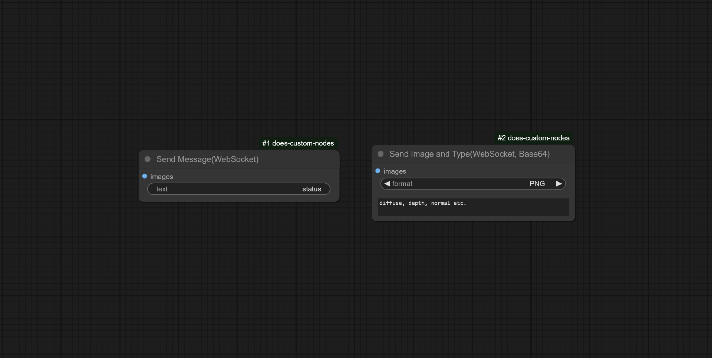

# does-custom-nodes

🐑 Simple nodes to make integration with external tools more clear. Added functionality to let the client know what type of image is sent.

## Included nodes
- Unity integration
  - Send image with type
  - Send image with message
  - Send status message
- Computer vision
  - Classify image (compatible with teachable machine models)
  - Classify image using Hugging Face models

- Utilities
  - Check if mask is empty
